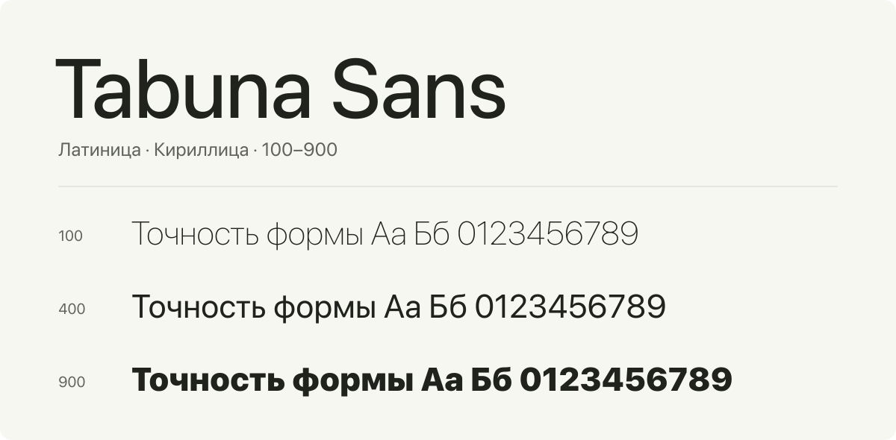

# Tabuna Sans

Компактный вариативный шрифт с латиницей и русской кириллицей.
Одна гарнитура для интерфейсов, заголовков, коротких подписей и числовых данных.
Знакомые пропорции неогротеска, открытые формы и плавный переход от тонкого к жирному.



**[Скачать WOFF2](dist/TabunaSansVariable.woff2?raw=true)** ·
**[Скачать TTF](dist/TabunaSansVariable.ttf?raw=true)** ·
[Все символы](sources/compact-charset.txt) · [Лицензия](OFL.txt)

## Один файл, девять начертаний

Tabuna Sans поддерживает любой вес от **100 до 900**, включая промежуточные
значения — например, 350 или 550. Оптический размер **9–128** меняет пропорции
в зависимости от размера текста.

| Вес | Начертание | Вес | Начертание | Вес | Начертание |
|---|---|---|---|---|---|
| 100 | Thin | 400 | Regular | 700 | Bold |
| 200 | ExtraLight | 500 | Medium | 800 | ExtraBold |
| 300 | Light | 600 | SemiBold | 900 | Black |

В наборе одно прямое начертание с двумя осями вариативности. Курсив не включён.
Веб-версия занимает около **84 КиБ** и содержит весь набор символов.

## Набор символов

**189 символов**: английский и русский алфавиты, цифры, пунктуация,
валютные и математические знаки. Буквы `Ё` и `ё` включены.

```text
ABCDEFGHIJKLMNOPQRSTUVWXYZ
abcdefghijklmnopqrstuvwxyz
АБВГДЕЁЖЗИЙКЛМНОПРСТУФХЦЧШЩЪЫЬЭЮЯ
абвгдеёжзийклмнопрстуфхцчшщъыьэюя
0123456789
! " # $ % & ' ( ) * + , - . / : ; < = > ? @ [ \ ] ^ _ ` { | } ~
£ ¥ © « ® ° ± · » × ÷ – — ‘ ’ “ ” „ … € ₽ № − ∞ ≠ ≤ ≥
```

Также доступны обычный пробел `U+0020` и неразрывный пробел `U+00A0`.
Набор намеренно ограничен: расширенная латиница, другие кириллические
алфавиты и эмодзи в файл не входят.

## Подключение на сайте

Скопируйте WOFF2 в каталог со шрифтами и добавьте:

```css
@font-face {
  font-family: "Tabuna Sans";
  src: url("/fonts/TabunaSansVariable.woff2") format("woff2");
  font-style: normal;
  font-weight: 100 900;
  font-display: swap;
}

body {
  font-family: "Tabuna Sans", system-ui, sans-serif;
  font-optical-sizing: auto;
  font-weight: 400;
}

h1 {
  font-weight: 650;
}
```

Готовый вариант подключения — [dist/tabuna.css](dist/tabuna.css):
поместите CSS рядом с WOFF2 и примените класс `.tabuna` к нужному элементу.

## Цифры и набор текста

Шрифт содержит кернинг, стандартные лигатуры, контекстные подстановки,
пропорциональные и табличные цифры. Табличные цифры удобны для таблиц,
счётчиков и цен: каждому разряду отводится одинаковая ширина.

```css
.price,
.counter {
  font-variant-numeric: tabular-nums;
}

.prose {
  font-variant-numeric: proportional-nums;
}
```

Оптический размер обычно выбирается автоматически. Для явного управления:

```css
.caption {
  font-optical-sizing: none;
  font-variation-settings: "opsz" 12;
  font-weight: 400;
}
```

## Форматы

| Файл | Назначение |
|---|---|
| [TabunaSansVariable.woff2](dist/TabunaSansVariable.woff2) | Подключение на сайте |
| [TabunaSansVariable.ttf](dist/TabunaSansVariable.ttf) | Установка в системе и приложения с поддержкой вариативных шрифтов |
| [tabuna.css](dist/tabuna.css) | Готовое объявление `@font-face` и класс `.tabuna` |

## Лицензия

Tabuna Sans распространяется по **SIL Open Font License 1.1**.
Полные условия использования, изменения и распространения — в [OFL.txt](OFL.txt).

## Подробнее

[Геометрия и формулы](FONT-MODEL.md) · [Текущие характеристики качества](QUALITY-REPORT.md) ·
[Сборка и локальный просмотр](docs/BUILDING.md) · [Документация](docs/README.md).
