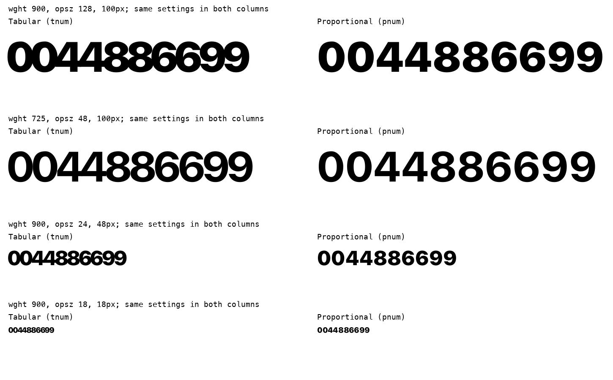

# Независимый аудит Tabuna Sans: интерфейсы и чтение

**Вердикт: ограниченный пилот допустим; безусловную готовность для UI, заголовков и длительного чтения не подтверждаем. Перед общим выпуском нужно исправить табличные цифры и идентификацию сборки.**

Проверен один неизменный снимок: TTF `5888eecc912f46f14b7807906d2ffc0a42d543a3695465b76a83b699373344b9`, WOFF2 `9c5c23886f3cac3acca41e9db66bdde9a69e5145453e1a84e24605bc31b43e59`. Во время аудита шрифт и генератор не менялись.

Это десять агентных профессиональных ролей: девять рецензентов в отдельных контекстах и арбитр, выполнивший собственную браузерную проверку. Они не являются реальными приглашёнными людьми, сотрудниками Apple или Steve Matteson. Первичные рецензенты не опирались на прежние дизайн-вердикты; часть новых изображений использовалась несколькими ролями. Затем проведена перекрёстная критика. Это независимый пересмотр прежнего результата, но не десять независимых экспериментов с людьми и не голосование за качество.

Apple HIG служит рамкой: ясность, адаптация текста, различимость и доступность важнее характера. Apple рекомендует осторожность с тонкими начертаниями и поддержку увеличения текста; конкретные диапазоны Tabuna ниже — наши рабочие гипотезы, не нормы Apple. [Apple Typography](https://developer.apple.com/design/human-interface-guidelines/typography), [Apple Accessibility](https://developer.apple.com/design/human-interface-guidelines/accessibility).

## Пригодность по сценариям

| Сценарий | Вердикт | Начальная настройка для веб-пилота | Ограничение |
|---|---|---|---|
| UI: подписи, настройки, сообщения | Условно подходит | 14–20 px, 400–500, `opsz:auto`, обычный tracking | Платформенные минимумы зависят от приложения; тонкий 100 не использовать как стандарт важных мелких подписей |
| Буквенные заголовки | Подходит в просмотренных образцах | 24–48 px, 500–700, `opsz:auto` | Не переносить плотный display tracking и тесный интерлиньяж на мелкий текст |
| Цифры в таблицах и KPI | Нельзя рекомендовать весь диапазон | Обычные пропорциональные цифры визуально лучше разделены | Heavy/display `tnum` имеет подтверждённые наложения; 400/500 `tnum` требует реалистичных таблиц, а не предположения по pnum |
| Абзацы, справка, короткие статьи | Кандидат для пилота | 16–18 px, 400, интерлиньяж около 1.5; 500 как отдельный вариант | Это визуальный скрининг, не измеренная скорость или понимание |
| Продолжительное чтение | Не подтверждено | Начать с 17 px / 400 / 1.55 в сравнении с system-ui | Нет результатов читателей, измерений утомления и подтверждения для разных зрительных условий |

Размеры указаны в CSS px; их нельзя механически переносить в iOS pt. Вес 100 остаётся допустимой частью гарнитуры — ограничивается его применение, а не диапазон шрифта.

## Матрица десяти ролей

| Роль | Независимый вывод | Значение для решения |
|---|---|---|
| [1. Типографика и формы](type.md) | 400/500 в коротких RU/EN образцах согласованы; Thin малым размером слаб; формы I/l/1 различаются | Сохранить рисунок, ограничить назначение тонких весов |
| [2. OpenType и инженерия](engineering.md) | Реальные наложения `tnum`, устаревшие URL и совпадение версии с контрольной сборкой | Обязательные исправления до общего выпуска |
| [3. Доступность / Apple HIG](accessibility.md) | Хороший номинальный контраст не спасает тонкий штрих; native accessibility и длительное чтение не доказаны | Настройки по ролям, реальные платформенные проверки |
| [4. Чтение и браузерная интеграция](reading-integration.json) | 64 условия отдельного адаптивного образца без обрезаний; 320 px с увеличением и интервалами без горизонтального переполнения | Шрифт можно встроить адаптивно; это не сертификация основного демо или приложения |
| [5. Методика исследования чтения](reading-method.md) | Из параллельного просмотра одинаковых коротких текстов нельзя вывести скорость, понимание и утомление | Анонимный контрбалансированный пилот, затем исследование при необходимости |
| [6. Кириллица и редактура](cyrillic-editor.md) | Явный дефект проверенных русских букв не установлен; важны пробелы в суммах, fallback и составные диакритики | Контентные правила и проверка смешанного текста |
| [7. Дизайн desktop UI](ui-designer.md) | Демо сохраняет display-интервалы на малом размере; часть служебного текста слишком мала; кнопки демо используют system-ui | Демо пока не доказывает пригодность Tabuna для всех контролов |
| [8. Выпуск и воспроизводимость](release-review.md) | Версия и unique ID не различают сборки; кеш CSS/шрифта может скрыть обновление | Исправить цепочку идентификации, не обязательно менять family/PostScript names |
| [9. Растр и экраны](raster-review.md) | 1x Thin слаб; FreeType 2x и увеличение картинки не равны реальному Retina/CoreText | Зафиксировать настоящие устройства и рендереры |
| [10. Дизайн числовых данных](data-designer.md) | Равная ширина ячеек не обеспечивает разделение цифр; нужны таблицы, суммы и десятичные столбцы | Тестировать залитые контуры, просветы и выравнивание вместе |

## Подтверждённый дефект: табличные цифры

Среди 100 пар цифр в 48 выбранных положениях осей инженерный тест нашёл **217 положительных пересечений залитых контуров из 4800 проверок `tnum`**. На той же сетке `pnum` — **0 из 4800**. Это не сравнение bounding box: использован `pathops.INTERSECTION` после позиционирования HarfBuzz. Первые пересечения могут быть субпиксельными; крупные слияния видны непосредственно.

Примеры: `44` при `wght=725, opsz=24`; существенное слияние `0044886699` при `900/128`. Браузер подтвердил загрузку лица, диапазон весов и `font-synthesis:none`; слияния видны в явном `900/128`, а скученность/слияния также в auto-строках 32 px / 900 и 48 px / 725. Реальное выбранное браузером значение auto-opsz не выдаётся за равное CSS px. [Браузерные измерения](numeric-browser.json).

## Что решил арбитр после споров

1. **«Буквы выглядят хорошо» не отменяет числовой дефект.** Типографический обзор использовал BASIC-рендеринг Pillow, поэтому не проверял поведение `tnum`. После проверки инженерного метода и изображения типограф и рецензент доступности признали P1. [Типографическая критика](type-cross-critique.md), [критика доступности](accessibility-cross-critique.md).
2. **Прежние зелёные проверки имели недостаточную область.** `scripts/verify.py` сравнивает результаты shaping между форматами, включая tnum/pnum, но не проверяет межзнаковые наложения. `interface_corpus.py` формирует текст с обычными features. Совпадение с эталоном или между форматами может сохранить один и тот же дефект. Новый аудит запрещает считать это доказательством общей UI-пригодности.
3. **Покрытие 189 символов сохраняем.** Отсутствие `•`, `‰` и составных диакритик не нарушает утверждённый репертуар. Требуется проверенный fallback и контентная политика. В прямом рендере без fallback пропуски дают `.notdef`; это не означает, что браузер с корректным стеком обязательно покажет тот же результат.
4. **64 проверки адаптации закрывают только свою фикстуру.** Текст увеличивался CSS-размером, а не настоящим browser zoom. `overflow-wrap:anywhere` предотвращает часть переполнений ценой разрывов слов. Отсутствие потери контента не равно хорошему чтению. WCAG требует переносить пользовательские изменения интервалов без потери информации; это не предписание использовать их как постоянный дизайн. [WCAG Text Spacing](https://www.w3.org/WAI/WCAG22/Understanding/text-spacing.html), [Resize Text](https://www.w3.org/WAI/WCAG22/Understanding/resize-text.html), [Reflow](https://www.w3.org/WAI/WCAG22/Understanding/reflow.html).

## Обязательные действия и приёмка

| ID | Приоритет / когда обязательно | Конкретное действие | Проверка завершения |
|---|---|---|---|
| IA-01 | P1, до общего выпуска с поддержкой tnum | Исправить общую ширину табличных цифр и/или их боковые интервалы по обеим осям; сохранить равные advances | Все 100 пар, masters и промежуточные оси: нет непреднамеренных пересечений, есть видимое разделение; строки, цены и таблицы проверены в браузере. Не закрывать только добавлением глобального tracking |
| IA-02 | P2, до публикации новых бинарников | Развести версию/revision/unique ID контрольной и авторской сборок | Метаданные отличаются согласованно; установка/обновление и кеш не подменяют один файл другим; family имена меняются только при необходимости |
| IA-03 | P2, до веб-публикации | Обновлять fingerprint шрифта, preload и CSS согласованно | После обновления страницы с прежним кешем загружены CSS и WOFF2 текущих SHA; сборщик проверяет всю цепочку |
| IA-04 | P2, до широкой UI-рекомендации | Описать и показать пресеты UI/body/display в существующем демо; исправить перенос display tracking/leading на мелкий текст | Кнопки/подписи/абзацы действительно используют Tabuna, не system-ui; проверены малые размеры, длинные RU строки, увеличение и обе темы |
| IA-05 | P2, до использования произвольного пользовательского текста | Проверить fallback, NFC/NFD, суммы с неразрывными пробелами и валюты | Нет misleading `.notdef`, потерянных диакритик и разрывов суммы/валюты; репертуар не расширяется автоматически |
| IA-06 | P2, до платформенной рекомендации | Safari/CoreText, Chromium на macOS, Windows/DirectWrite; реальные 1x/2x, auto opsz, пользовательское увеличение | Записаны устройства и версии, рендеры/ошибки по фиксированным случаям; Dynamic Type/VoiceOver проверяются в целевом native-приложении, если оно заявлено |
| IA-07 | До утверждения пригодности для длительного чтения | Провести анонимный контрбалансированный RU/EN пилот с читателями | Время + понимание + ошибки + утомление, отдельные языки/устройства; заранее зарегистрированные допуски. Пилот не доказывает универсальную читаемость |

Для IA-07 подготовлен [исполняемый протокол пилота на 16 участниках](reading-method.md): две сессии, разные сопоставимые тексты, скрытая идентификация шрифта, сбалансированный порядок и обычные зрительные приспособления участников. Предложенные допуски — продуктовые решения для предварительного согласования, не научные нормы и не уже полученные результаты.

**Рекомендация по выпуску: HOLD.** Причина — IA-01; IA-02/03 также обязательны перед соответствующей публикацией. Остальной рисунок целиком переделывать по этому аудиту оснований нет. Следующий шаг — исправить табличные цифры и выпускные идентификаторы, после чего повторить адресные проверки и начать ограниченный UI/body-пилот.
