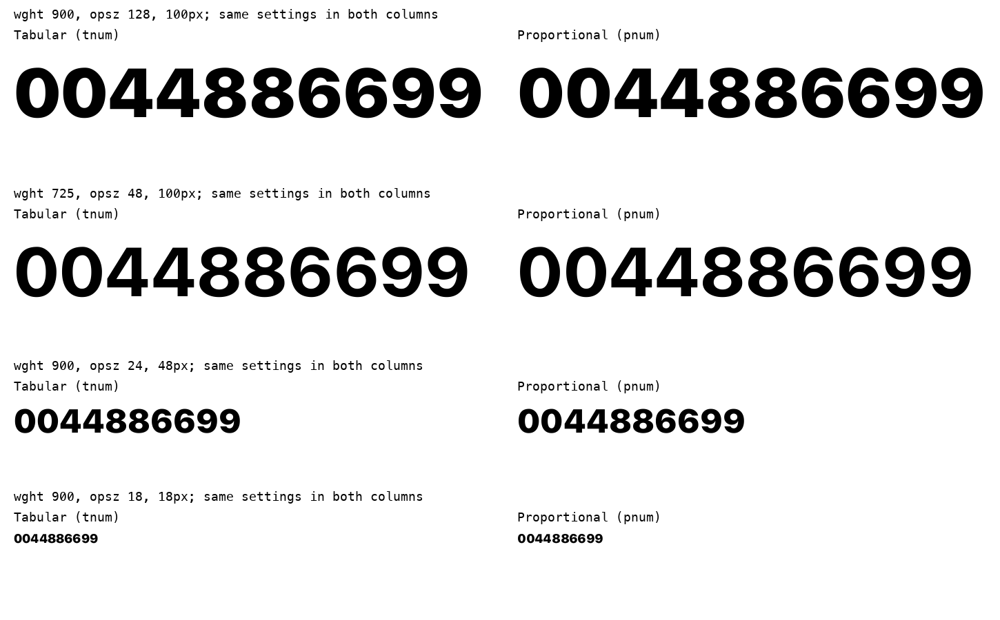

# Исправления независимого аудита

Локальная сборка **0.0.2** устраняет найденное слипание табличных цифр.
Контрольный GitHub-выпуск 0.0.1 не изменён. Новый выпуск не опубликован.

| Замечание | Изменение и проверка | Вердикт |
|---|---|---|
| IA-01 | Общая ширина по финальным контурам мастеров; центрирование цифр. 30 600 пар в 153 положениях осей, без пересечений. Табличные ширины равны; минимальный просвет 131,506/2048 em. Проверены тяжёлые числовые строки в браузере и FreeType. | Исправлено |
| IA-02 | Version 0.0.2, новый head revision и unique ID; стабильное имя семейства. | Исправлено |
| IA-03 | Хеш шрифта → хеш CSS → ссылки HTML; preload и JS согласованы. Тест смены содержимого и повторного запуска прошёл. | Исправлено |
| IA-04 | Роли UI/текст/заголовок; нормальный трекинг мелкого текста; каталог400; подписи от13px; реальные контролы с Tabuna. После исправления меню на320px ширина документа320px. | Исправлено в демо |
| IA-05 | Сохранены189 символов; описаны fallback, NFC и неразрывные суммы. Формирование Ё/ё/Й/й в NFC/NFD совпадает в четырёх положениях осей. | Частично проверено; произвольный контент проверяется в приложении |
| IA-06 | Проверено доступное окружение macOS, браузер приложения и FreeType/HarfBuzz. | Windows, реальные1x/2x и нативная доступность ещё не проверены |
| IA-07 | Сохранён протокол исследования; ограничены заявления о чтении. | Нужны реальные участники |



Две полные сборки совпали побайтово. Форматы TTF/WOFF2 прошли 5232 сравнения
геометрии и48 проверок формирования текста. Вне десяти вариантов `tnum`
не изменились базовые контуры, вариации и ширины; таблицы формирования текста
также сохранены. Это доказательство границ изменения, а не новое исследование
читаемости. Новые табличные ширины требуют проверки контейнеров потребителя.

Вердикт исполнителя исправлений: технические дефекты IA-01–04 устранены.
Это не новый независимый разбор и не заключение сотрудников Apple.
Публикационный флаг остаётся закрытым: прежние авторские доказательства
привязаны к предыдущему бинарному файлу. Человеческое исследование нельзя
заменить автоматическими проверками.

[Машиночитаемый итог](remediation.json) · [Первоначальный независимый аудит](AUDIT.md)

Повторить проверки из корня репозитория:

```sh
scripts/build-web.sh
.venv/bin/python scripts/verify.py
.venv/bin/python scripts/test_web_cache.py
.venv/bin/python -m unittest font_recovery.test_design_status font_recovery.test_character_families
```
