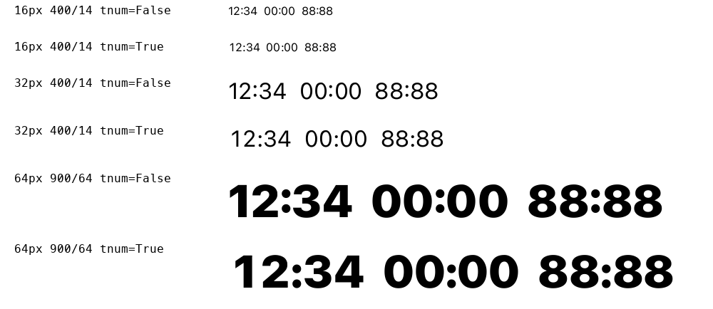

# Независимая матрица Tabuna Sans 0.0.2

**Вывод: шрифт подходит для ограниченного пилота UI, обычного текста и заголовков.
Безусловное одобрение для таймеров, сложных интерфейсов и длительного чтения пока не получено.**
Новая конкретная ошибка — потеря поднятого двоеточия при включении табличных цифр.
Собственный характер в обычной строке пока недостаточно подтверждён слепыми сравнениями.

Проверена текущая сборка: **189 символов, wght100–900, opsz9–128, WOFF2 93 128 байт**.
TTF SHA-256: `3567058955eb20ebaf25ef5241a094b25d86dfd7be966f8032492dd3caa3e011`.
Шрифт, исходное демо и его стили во время разбора не изменялись.

## Как обеспечена независимость

Десять отдельных агентов получили свежие контексты и запрет читать прежние
заключения и ответы коллег до своего первого отчёта. Первоначальные MD/JSON
зафиксированы [контрольными суммами](initial-locks.json). Затем три рецензента
провели перекрёстную критику; арбитр воспроизвёл спорные наблюдения.
Две роли сначала оценили одинаковые обезличенные пары A/B без ключа.

Это **десять агентных ролей одной модельной семьи**, а не десять людей,
не внешняя дизайнерская комиссия и не сотрудники Apple или Steve Matteson.
Независимость контекстов уменьшает взаимное влияние, но не устраняет общие
модельные предубеждения. Apple HIG задаёт направление проверки адаптации
и доступности; все выводы о конкретном шрифте принадлежат этому разбору.

## Матрица после споров

«В рамках теста — да» означает положительный вывод только в условиях,
перечисленных в отчёте этой роли. «Условно» означает пилот с конкретными
ограничениями. Эти клетки нельзя складывать в процент готовности.

| Независимая роль | UI | Заголовки | Текст | Длительное чтение |
|---|---|---|---|---|
| [Apple HIG и доступность](hig.md) | Условно | Условно | Условно | Нет данных |
| [Конструкция шрифта](type.md) | Условно | В рамках теста — да | Условно | Нет данных |
| [OpenType и интерполяция](engineering.md) | Условно | В рамках теста — да | Условно | Нет данных |
| [Кириллица и редактура](cyrillic.md) | Условно | В рамках теста — да | В рамках теста — да | Нет данных |
| [Продуктовый UI](ui.md) | Условно | В рамках теста — да | Условно | Нет данных |
| [Таблицы и числовые данные](data.md) | Условно | Условно | Условно | Нет данных |
| [Экранная растеризация](raster.md) | Условно | Условно | Условно | Нет данных |
| [Методология чтения](reading.md) | Условно | В рамках теста — да | Условно | Нет данных |
| [Сборка и публикация](release.md) | Условно | Условно | Условно | Нет данных |
| [Характер и узнаваемость](character.md) | Условно | В рамках теста — да | Условно | Нет данных |

Для числовых заголовков оценка data-рецензента изменена с «да» на «условно»
после проверки двоеточия. Инженерный и упаковочный разборы не заменяют
визуальную оценку или чтение с людьми.

## Что подтверждено испытаниями

- Независимая инженерная проверка: 21 582 вычисления контуров в 99 положениях
  осей, 18 711 проверок метрик кодированных знаков, 990 проверок табличных
  цифр и 5 292 растеризации прошли. Это проверки определённых свойств,
  а не исчерпывающий поиск всех визуальных дефектов.
- Data-рецензент выполнил 960 проверок формирования текста/ширин и осмотрел
  два числовых образца. Равенство ширин подтвердилось; вертикальное
  положение пунктуации первоначально не входило в его критерий.
- Отдельный release-рецензент пересобрал шрифт в изолированном каталоге:
  TTF и WOFF2 совпали побайтово. 5 450 сравнений геометрии и ширин и все 9
  ссылок с хешами ресурсов прошли.
- В осмотренных RU/EN-строках веса 400–500 нет подтверждённого дефекта,
  требующего переделки всей гарнитуры. Кириллический редактор не установил
  конкретной поломки Д/Л/д/л/б/в/ж/к/я в своём наборе образцов.
- Растеризатор проверен в 32 сочетаниях размеров/весов/масштабов.
  Это эмуляция растров 1×/2×, **не испытание двух физических экранов**.
  Малый вес 100 бледен;900 в мелком тексте плотный. Для основных подписей
  и абзацев сохраняется рекомендация 400–500 и согласованного opsz.
- Дополнительная браузерная матрица арбитра:48 сочетаний ширины 280/640 px,
  размера 14/18/28/36 px, веса 400/500/900, светлого/тёмного фона. Кнопки
  не переполнились, суммы одинакового формата имели одинаковую ширину.
  В 8 случаях увеличенные суммы не поместились в фиксированную половину
  таблицы; в 6 случаях переполнился контейнер. Это намеренно тесный
  испытательный макет, **не доказательство регрессии демо или контура**.
  Он показывает, почему увеличение текста требует адаптации колонок.

Счётчики разных проверок не суммируются: они частично перекрываются и
проверяют разные свойства.

## Какие споры разрешены

**«Таймеры прошли» против «двоеточие неверно».** Оба первичных наблюдения
были совместимы: ширина `00:00:00` стабильна, но `tnum` заменяет цифры раньше
контекстной обработки, и вместо `colon.case` используется низкий `colon`.
При 400/14 разница составляет 215 единиц — около 1,68 px при 16 px.
Инженер и data-рецензент независимо подтвердили это в повторном разборе.
Вердикт: **исправление M01 обязательно перед безусловным одобрением таймеров**.
Это нарушение выбранного выравнивания, а не потеря цифр или дрожание ширины.

**«У l нет нижнего выхода».** В текущем контуре выход есть:88 единиц при 400/14,
около 0,69 px при 16 px. Рецензент [отозвал утверждение об отсутствии](type-critique.md).
Остаётся проверяемая гипотеза о недостаточной заметности детали в малом тексте.
Вердикт: не менять весь рисунок по ошибочному диагнозу; сначала тест M04.

**«Нужно добавить пробелы, акценты и валюты».** Их отсутствие вне утверждённых
189 символов не является ошибкой покрытия согласованного набора.
Data-рецензент [отозвал обязательное расширение и непригодный критерий](data-critique.md)
«нет .notdef при font-only shaping» для исключённых знаков.
Вердикт: сохранить 189; проверять реальный системный fallback в интеграции M08.

**«Нужно немедленно усилить характер».** Оба слепых рецензента не смогли
надёжно отличить характер A/B в показанных обычных RU/EN-строках, но заметили
перекладины I у B. После фиксации оценок раскрыт ключ: A — контроль 0.0.1,
B — текущая 0.0.2. Это не означает, что контуры идентичны или характера нет;
это означает, что заявленный эффект не доказан данным образцом.
Порядок A/B был фиксированным, строки короткими, рецензенты — моделями.
Вердикт: M05 обязателен перед заявлением о доказанной узнаваемости;
усиление пластики без нового сравнения не предписывается.

[Обезличенный образец](assets/blind-pairs.png) ·
[Чтение: слепая оценка](reading.md) · [Характер: слепая оценка](character.md)

## Обязательные следующие действия

Обязательность относится к указанному применению/заявлению. Отсутствие
исследования длительного чтения не запрещает ограниченный пилот заголовков.

| ID | Приоритет | Что выполнить | Когда требуется |
|---|---|---|---|
| M01 | P2 | Согласовать контекстное двоеточие с tnum/pnum; проверить высоту, ширину и взаимодействие calt в обоих форматах и по осям | Таймеры и числовые заголовки без оговорок |
| M02 | P2 | Заново принять D01–D06 и авторские отклонения на окончательном бинарном файле; не просто заменить хеши | Принятый авторский выпуск |
| M03 | P2 | Реальные формы, диалоги, плотные подписи, суммы и увеличение текста 200% на узком экране; адаптация колонок | Широкая рекомендация для UI |
| M04 | P2 | Проверить ошибки распознавания I/l/1, O/0, З/3 в случайных идентификаторах; сохранить существующие различители до результата | Ответственные идентификаторы |
| M05 | P2 | Новые RU/EN-строки, смена порядка A/B, повторные обезличенные сравнения; отделить узнаваемость строки от одной I | Заявление о доказанном собственном характере |
| M06 | P2 | Человеческий пилот чтения и реальные целевые платформы/экраны/адаптация доступности | Длительное чтение и универсальные платформенные заявления |
| M07 | P3 | Устранить ссылку REVIEW.md и зависимость публичного сравнения от отсутствующих в чистой копии proof-файлов | Полностью работающая публикация демо |
| M08 | P2 | Проверить fallback, NFC/NFD и пробелы форматирования на реальных локализованных строках | Произвольный пользовательский контент |

Для каждого пункта в [matrix.json](matrix.json) сохранены ответственная роль,
конкретный критерий приёмки, основание и статус `open`. Текущий проектный
публикационный gate уже закрыт из-за непринятых доказательств D01–D06.
Сам gate ещё не проверяет все новые M01–M08; эта матрица не выдаёт их за
автоматически исполняемые тесты. Публикационное решение должно учитывать
применимые открытые пункты, даже если прежние технические тесты зелёные.

Ближайшая эффективная последовательность: **M01 → M03 и M07 → повторная
приёмка M02**. M04/M05/M06 объединить в отдельную программу испытаний,
сохраняя спокойный компактный рисунок до получения данных. Не требуется
новая массовая перерисовка или расширение набора ради устранения найденного.

## Доказательства

[Машиночитаемая матрица и критерии](matrix.json) ·
[Первичные контрольные суммы](initial-locks.json) ·
[Архив рендеров, измерений и кода](evidence.zip) ·
[Манифест архива](evidence-manifest.json) ·
[Контроль неизменности сборки](snapshot.json)

Перекрёстная критика: [инженер](engineering-critique.md),
[data-дизайнер](data-critique.md), [шрифтовой дизайнер](type-critique.md).
Исходные заключения сохранены, включая впоследствии отозванные формулировки.
Арбитр проверял расхождения по данным, а не голосованием.
