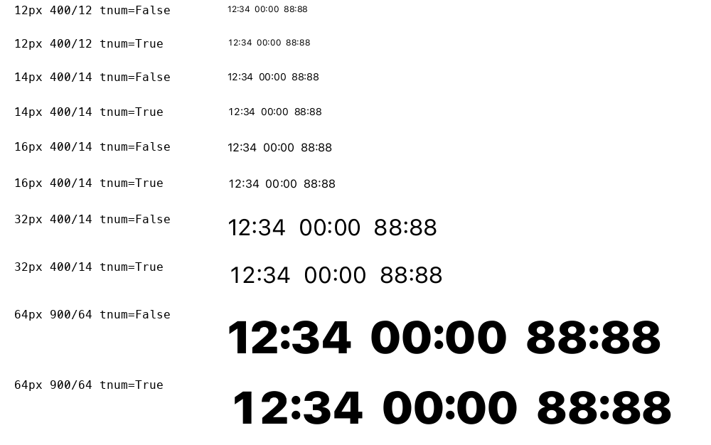

# Исправление двоеточия в таймерах — 0.0.3

**M01 / ENG-001 исправлено.** Включение `tnum` сохраняет контекстное
двоеточие той же высоты, что и обычные цифры. Исправление выполнено
в GSUB шрифта: в контекстные классы добавлены табличные варианты цифр.
Контуры, метрики, вариационные таблицы и остальные правила сохранены.

Новый тест воспроизвёл ошибку на 0.0.2:214 неудачных проверок из 1888
в одном положении осей. После исправления **220 896 проверок контекстов
в 117 положениях осей прошли**, включая TTF/WOFF2, default/tnum/pnum,
их совместное включение, calt on/off, буквенные и смешанные контексты.
234 группы таймеров одинакового формата сохранили равную ширину.
110 448 сравнений формирования текста между форматами совпали.

Проверка 30 600 пар цифр снова прошла без пересечений. Проверки форматов:
5232 сравнения геометрии и 48 сравнений формирования текста прошли.
Растры осмотрены при 12/14/16/32/64 px, браузерные образцы — при 14/32/64 px
на светлом и тёмном фоне. `calt=0` намеренно возвращает обычное двоеточие.



Тест добавлен в `scripts/build-web.sh` и в условия авторского release gate:
отсутствующий, неуспешный или устаревший результат не допускает выпуск.
Исправление M01 не закрывает остальные замечания независимой матрицы.
0.0.3 — локальная сборка; GitHub-выпуск 0.0.1 не изменён.

[Итог закрытия M01](closure.json) · [Границы изменения](scope.json) ·
[Полный результат теста](../timer-verification.json) ·
[Прежняя ошибка](regression-before.json)

```sh
scripts/build-web.sh
.venv/bin/python scripts/verify.py
.venv/bin/python -m unittest font_recovery.test_design_status font_recovery.test_character_families
```
